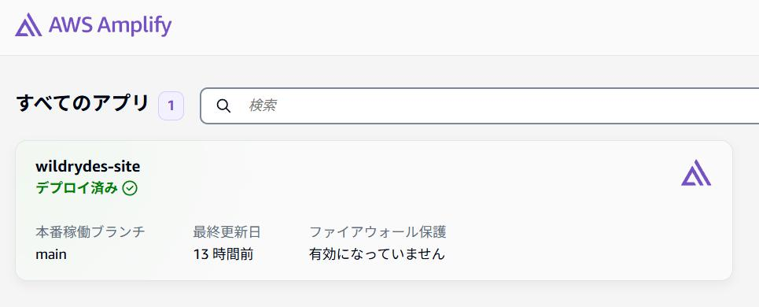
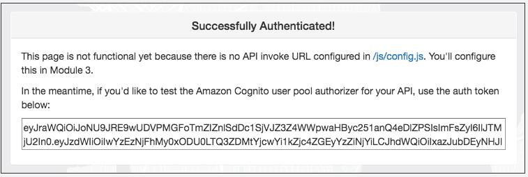
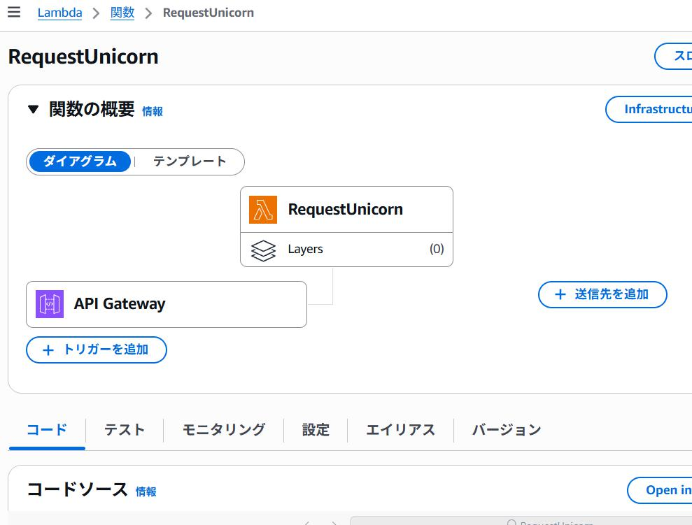
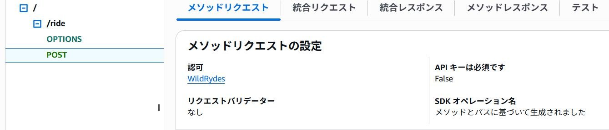
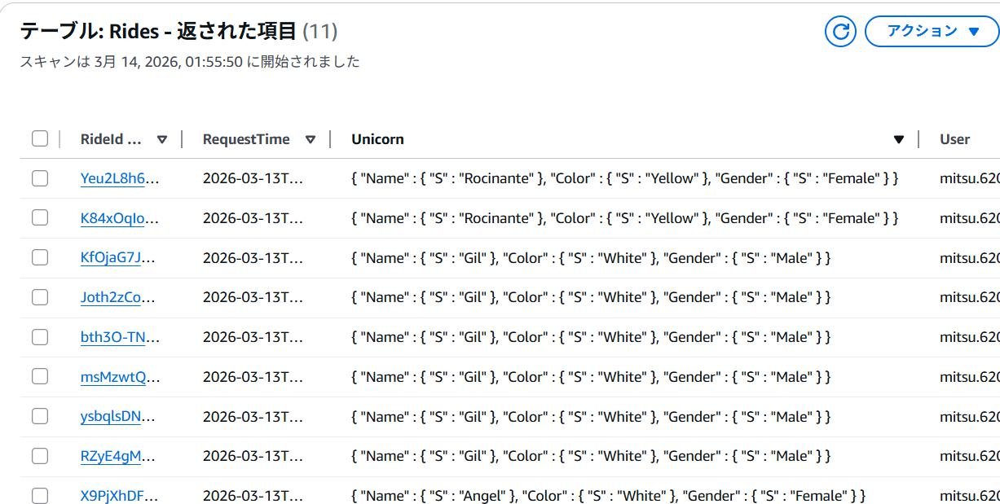

# wildrydes-site

## 概要
AWSでのアプリ構築の自己学習を目的として構築しました。<br>
参考：[サーバーレスのウェブアプリケーション構築](https://aws.amazon.com/jp/getting-started/hands-on/build-serverless-web-app-lambda-apigateway-s3-dynamodb-cognito/)

## アプリケーションのアーキテクチャ
- AWS Amplify
- Amazon Cognito
- AWS Lambda
- Amazon DynamoDB
- Amazon API Gateway

#### <アーキテクチャ>


- Amplify コンソールは、継続的デプロイと、HTML、CSS、JavaScript、およびユーザーのブラウザにロードされたイメージファイルなどを含む静的なウェブリソースのホストを提供します。
- ブラウザで実行される JavaScript は、Lambda と API Gateway を使用して構築されたパブリックバックエンド API からデータを送受信します。
- Amazon Cognito は、バックエンド API を保護するためのユーザー管理機能と認証機能を提供します。さらに、DynamoDB は API の Lambda 関数によってデータを格納できる永続レイヤーを提供します。

## 手順

### 事前設定
- AWS CLIインストール<br>
[AWS公式ガイド](https://docs.aws.amazon.com/cli/latest/userguide/getting-started-install.html)

- AWS CLIの認証情報設定<br>
[AWS公式ガイド](https://docs.aws.amazon.com/cli/latest/userguide/cli-configure-sign-in.html)


- ArcGIS 登録アカウント<br>
[登録サイト](https://www.arcgis.com/sharing/rest/oauth2/authorize?client_id=arcgisonline&response_type=token&display=default&state=%7B%22portalUrl%22%3A%22https%3A%2F%2Fwww.arcgis.com%22%2C%22useLandingPage%22%3Atrue%2C%22clientId%22%3A%22arcgisonline%22%7D&expiration=20160&locale=ja&redirect_uri=https%3A%2F%2Fwww.arcgis.com%2Fhome%2Faccountswitcher-callback.html&force_login=true&hideCancel=true&showSignupOption=true&canHandleCrossOrgSignIn=true&signuptype=esri&redirectToUserOrgUrl=true&allow_verification=true)

### モジュール 1: 継続的デプロイを使用した静的ウェブホスティング
- 使用技術：AWS Amplify
- 概要：<br>継続的デプロイのビルトインでウェブアプリケーションの静的リソースをホストするように AWS Amplify を設定します。Amplify コンソールには、継続的デプロイと、フルスタックのウェブアプリをホストするための Git ベースのワークフローが用意されています。後続のモジュールでは、JavaScript を使用してこれらのページに動的機能を追加し、AWS Lambda と Amazon API Gateway で 構築されたリモート RESTful API を呼び出します。
<details>
<summary>ここをクリックで開く</summary>
  
- リージョンの選択：ap-northeast-1
- Gitリポジトリ作成
- Gitリポジトリの事前設定(S3バケットからコードをコピー)
  - ~~このチュートリアルに関連付けられた一般がアクセスできる既存の S3 バケットからウェブサイトのコンテンツをコピーし、リポジトリにコンテンツを追加~~
  - aws-samples公式リポジトリのIssueを参考にS3をclone
  - originを自分のリポジトリに変更し、強制push
- AWS Amplify コンソールでウェブホスティングを有効にする
  -  AWS Amplify コンソールを使用してGitHubコードをデプロイ
- サイトを変更する
  -  Amplifyでリポジトリ変更時にアプリの再ビルド、再デプロイできるか確認

</details>

#### <サイトの画面>


#### <Amplifyの操作画面>



### モジュール 2: ユーザーを管理する
- 使用技術：Amazon Cognito
- 概要：<br>ユーザーのアカウントを管理するための Amazon Cognito ユーザープールを作成します。顧客が新しいユーザーとして登録し、自分の E メールアドレスを確認して、そしてサイトにサインインできるようにするページを配置します。<br>ユーザーがお客様のウェブサイトにアクセスすると、彼らは最初に新しいユーザーアカウントを登録します。​このワークショップの目的上、登録のために E メールアドレスとパスワードを提供するようにユーザーに要求するだけです。​ただし、独自のアプリケーションで追加の属性を要求するように Amazon Cognito を設定できます。<br>ユーザーが登録を送信した後、Amazon Cognito は提供されたアドレスに確認コードを記載した確認メールを送信します。ユーザーのアカウントを確認するには、ユーザーはお客様のサイトに戻り、自分の E メールアドレスと受け取った確認コードを入力します。​Amazon Cognito コンソールとテスト用のダミーの E メールアドレスを使用してユーザーアカウントを確認することもできます。<br>ユーザーが確認済みアカウントを取得した後 (コンソールでの E メール確認プロセスまたは手動確認のいずれかを使用)、サインインできるようになります。​ユーザーがサインインするときに、ユーザー名 (または E メール) とパスワードを入力します。その後、JavaScript 関数が Amazon Cognito と通信し、セキュアリモートパスワードプロトコル (SRP) を使用して認証して、一連の JSON ウェブトークン (JWT) を受け取ります。JWT にはユーザーの ID に関するクレームが含まれており、Amazon API Gateway で構築した RESTful API に対して認証するために次のモジュールで使用されます。​

<details>
<summary>ここをクリックで開く</summary>
  
- Amazon Cognito ユーザープールを作成し、アプリをユーザープールと統合する
  - ユーザープール名：WildRydes
  - アプリクライアント：WildRydesWebApp
  - ユーザープール ID をコピーして保存
  - クライアント ID をコピーして保存
- ウェブサイトの設定ファイルを更新する
  - wildryde-site/js/config.js ファイルを開く
  -  [ユーザープール ID] と [アプリクライアント ID] の正しい値に更新
  -  region の値は、ユーザープールを作成した AWS リージョンのコードから
  -  ``new_config``というコミット名でコミットしプッシュ
- 実装を検証する
  -  サイトのホームページ (index.html ページ) の [Giddy Up] ボタンをクリック
  -  登録フォームに入力して、[Let's Ryde] を選択。今回は自分の E メールを使用
  -  自分が管理する電子メールアドレスを使用した場合は電子メールで受け取った認証コードを入力して、アカウントの検証プロセスを完了
  -  Cognito コンソールを使用して新しいユーザーを確認
  -  登録ステップで入力した E メールアドレスとパスワードを使用してログイン
  -  成功した場合、/ride.html にリダイレクト。API が設定されていないという通知が表示される。
  - **重要**: 次のモジュールで Amazon Cognito ユーザープールオーソライザーを作成するために、認証トークンをコピーして保存
</details>

#### <sign up画面>


#### <APIがまだ設定されていないというアラート>


### モジュール 3: サーバーレスサービスバックエンド
- 使用技術：AWS Lambda , Amazon DynamoDB
- 概要：AWS Lambda と Amazon DynamoDB を使用して、ウェブアプリケーションのリクエストを処理するためのバックエンドプロセスを構築します。最初のモジュールにデプロイしたブラウザアプリケーションを使用すると、ユーザーはユニコーンを自分の好きな場所に送信するように要求できます。​これらのリクエストを満たすには、ブラウザで実行されている JavaScript がクラウドで実行されているサービスを呼び出す必要があります。​<br>ユーザーがユニコーンを要求するたびに呼び出される Lambda 関数を実装します。​この関数は、フリートからユニコーンを選択し、その要求を DynamoDB テーブルに記録してから、ディスパッチされているユニコーンに関する詳細を使用して、フロントエンドアプリケーションに応答します。<br>この関数は、Amazon API Gateway を使用してブラウザから呼び出されます。次のモジュールでその接続を実装します。このモジュールで必要なのは、ご利用の関数を単独でテストすることだけです。​

<details>
<summary>ここをクリックで開く</summary>

- Amazon DynamoDBテーブルを作成する
  - テーブル名：「Rides」
  - パーティションキー に「RideId」と入力、キータイプとして [文字列] 
  - 新しいテーブルの [概要] タブ > [一般情報] セクションで、[追加情報] を選択し、ARN をコピー
- Lambda 関数の IAM ロールを作成する
  - 概要：すべての Lambda 関数には、それに関連付けられた IAM ロールがあります。このロールは、その関数が他のどの AWS のサービスとやり取りできるかを定義します。このチュートリアルの目的のために、ログを Amazon CloudWatch Logs に書き込むアクセス許可と、項目を DynamoDB テーブルに書き込むアクセス許可を Lambda 関数に付与する IAM ロールを作成する必要があります。
  -  ロール名：「WildRydesLambda」
  -  ポリシー名：「DynamoDBWriteAccess」
- リクエスト処理のためにLambda関数を作成する
  - 概要：AWS Lambda は、HTTP リクエストなどのイベントに応答してコードを実行します。このステップでは、ウェブアプリケーションからの API リクエストを処理してユニコーンをディスパッチするコア機能を構築します。次のモジュールでは、Amazon API Gateway を使用して、ユーザーのブラウザから呼び出すことができる HTTP エンドポイントを公開する RESTful API を作成します。その後、このステップで作成した Lambda 関数をその API に接続して、ウェブアプリケーション用の完全に機能的なバックエンドを作成します。​
  - [関数名] フィールドに「RequestUnicorn」と入力
  - ~~[ランタイム] には [Node.js 16.x] を選択 (新しいバージョンの Node.js はこのチュートリアルでは動作しません)。~~
  - [ランタイム]に[Node.js 21.x]（選択できるもっとも古いバージョン）を選択
  - [既存のロール] ドロップダウンで [WildRydesLambda] を選択
  - [関数を作成] をクリック
  - ~~[コードソース] セクションまでスクロールし、index.js コードエディタの既存のコードを requestUnicorn.js の内容に置き換える~~
  - index.js コードエディタの既存のコードを置き換える
    - Node.js 21でも動く
    - aws-sdk はNode.js 18以降のLambdaでは削除されたので代わりに @aws-sdk/client-dynamodb を使う
    - ファイルが .mjs（ESモジュール）として認識されてしまう=requireが使えないためimportを使う
    - Node.js 24を使っているためcallbackが使えなくなっているためasync/awaitに書き換える
  ```
  import { randomBytes } from 'crypto';
    import { DynamoDBClient } from '@aws-sdk/client-dynamodb';
    import { DynamoDBDocumentClient, PutCommand } from '@aws-sdk/lib-dynamodb';

    const client = new DynamoDBClient();
    const ddb = DynamoDBDocumentClient.from(client);

    const fleet = [
        { Name: 'Angel', Color: 'White', Gender: 'Female' },
        { Name: 'Gil', Color: 'White', Gender: 'Male' },
        { Name: 'Rocinante', Color: 'Yellow', Gender: 'Female' },
    ];

    export const handler = async (event) => {
        if (!event.requestContext.authorizer) {
            return errorResponse('Authorization not configured');
        }

        const rideId = toUrlString(randomBytes(16));
        console.log('Received event (', rideId, '): ', event);

        const username = event.requestContext.authorizer.claims['cognito:username'];
        const requestBody = JSON.parse(event.body);
        const pickupLocation = requestBody.PickupLocation;
        const unicorn = findUnicorn(pickupLocation);

        try {
            await recordRide(rideId, username, unicorn);
            return {
                statusCode: 201,
                body: JSON.stringify({
                    RideId: rideId,
                    Unicorn: unicorn,
                    Eta: '30 seconds',
                    Rider: username,
                }),
                headers: { 'Access-Control-Allow-Origin': '*' },
            };
        } catch (err) {
            console.error(err);
            return errorResponse(err.message);
        }
    };

    function findUnicorn(pickupLocation) {
        console.log('Finding unicorn for ', pickupLocation.Latitude, ', ', pickupLocation.Longitude);
        return fleet[Math.floor(Math.random() * fleet.length)];
    }

    function recordRide(rideId, username, unicorn) {
        return ddb.send(new PutCommand({
            TableName: 'Rides',
            Item: {
                RideId: rideId,
                User: username,
                Unicorn: unicorn,
                RequestTime: new Date().toISOString(),
            },
        }));
    }

    function toUrlString(buffer) {
        return buffer.toString('base64')
            .replace(/\+/g, '-')
            .replace(/\//g, '_')
            .replace(/=/g, '');
    }

    function errorResponse(errorMessage) {
        return {
            statusCode: 500,
            body: JSON.stringify({
                Error: errorMessage,
            }),
            headers: { 'Access-Control-Allow-Origin': '*' },
        };
    }
  ```
- 実装を検証する(関数のテスト)
    - 概要：AWS Lambda コンソールを使用して構築した関数をテストする
    -  [テストイベントの設定] を選択
    -  [イベント名] フィールドに「TestRequestEvent」と入力
    -  次のテストイベントをコピーして、[イベント JSON] セクションに貼り付ける
  
  ```
    {
        "path": "/ride",
        "httpMethod": "POST",
        "headers": {
            "Accept": "*/*",
            "Authorization": "eyJraWQiOiJLTzRVMWZs",
            "content-type": "application/json; charset=UTF-8"
        },
        "queryStringParameters": null,
        "pathParameters": null,
        "requestContext": {
            "authorizer": {
                "claims": {
                    "cognito:username": "the_username"
                }
            }
        },
        "body": "{\"PickupLocation\":{\"Latitude\":47.6174755835663,\"Longitude\":-122.28837066650185}}"
        }
  ```
- 関数の [コードソース] セクションで [テスト] を選択し、ドロップダウンから [TestRequestEvent] を選択
- テスト実行
- 表示される「関数の実行: 成功」メッセージで、[詳細] ドロップダウンを展開

```
{
    "statusCode": 201,
    "body": "{\"RideId\":\"SvLnijIAtg6inAFUBRT+Fg==\",\"Unicorn\":{\"Name\":\"Rocinante\",\"Color\":\"Yellow\",\"Gender\":\"Female\"},\"Eta\":\"30 seconds\"}",
    "headers": {
        "Access-Control-Allow-Origin": "*"
    }
}
```

</details>

#### <Lambda操作画面>


### モジュール 4: RESTful API をデプロイする
- 使用技術：Amazon API Gateway
- 概要：Amazon API Gateway を使用して、前のモジュールで RESTful API として構築した Lambda 関数を公開します。この API はパブリックインターネットでアクセス可能になります。前のモジュールで作成した Amazon Cognito ユーザープールを使用して保護されます。次に、この設定を使用して、公開された API に対して AJAX 呼び出しを行うクライアント側 JavaScript を追加することにより、静的にホストされたウェブサイトを動的なウェブアプリケーションに変換します。<br>最初のモジュールでデプロイした静的ウェブサイトには、このモジュールで構築する API と連携するように設定済みのページが既にあります。/ride.html のページには、ユニコーンに乗ることを要求するシンプルなマップベースのインターフェイスがあります。/signin.html ページを使用した認証後、ユーザーはマップ上のポイントをクリックし、右上隅の [Request Unicorn] ボタンを選択して、乗る場所を選択することができます。

<details>
<summary>ここをクリックで開く</summary>

- 新しいREST APIを作成する
  - [API 名] ：「WildRydes」
- オーソライザーを作成する
  - 概要：Amazon API Gateway は、Amazon Cognito ユーザープール (モジュール 2 で作成) から返される JSON ウェブトークン (JWT) を使用して API 呼び出しを認証します。このセクションでは、ユーザープールを利用できるように、API のオーソライザーを作成します。
  - オーソライザーの [名前] フィールドに「WildRydes」と入力
  - Cognito ユーザープールの [名前] フィールドに「WildRydes」と入力
  - [トークンのソース] に「Authorization」と入力
  - ride.html ウェブページからコピーした認証トークンを [承認 (ヘッダー)] フィールドに貼り付け、HTTP ステータスの [レスポンスコード] が 200 であることを確認


- 新しいリソースとメソッドを作成する
  - 概要：このセクションでは、API 内に新しいリソースを作成します。その後、そのリソース用の POST メソッドを作成し、このモジュールの最初のステップで作成した RequestUnicorn 関数によってサポートされる Lambda プロキシ統合を使用するようにメソッドを設定します。
  - [リソース名] に「ride」と入力すると、リソースパス /ride が自動的に作成される
  - 新しいドロップダウンから [POST] を選択
  - 統合タイプとして [Lambda 関数] を選択
  - [Lambda 関数] に「RequestUnicorn」と入力
- APIをデプロイする
  - 概要：Amazon API Gateway コンソールから API をデプロイします
  - [ステージ名] に「prod」と入力
  - [呼び出し URL] をコピー
- ウェブサイトの設定を更新する
  - 概要：ウェブサイトのデプロイで /js/config.js ファイルを更新し、作成したステージの呼び出し URL を含めます。呼び出し URL は、Amazon API Gateway コンソールのステージエディタページの上部から直接コピーし、サイトの config.js ファイルの invokeUrl キーに貼り付けます。設定ファイルには、前のモジュールで行った Amazon Cognito userPoolID、userPoolClientID、およびリージョンの更新が引き続き含まれています。
  - ローカルマシンで js フォルダに移動し、任意のテキストエディタで config.js ファイルを開く
  - Amazon API Gateway コンソールからコピーした呼び出し URL を config.js ファイルの invokeUrl 値に貼り付ける
  - 更新した config.js ファイルを追加、コミット（`new_configuration`）、Git リポジトリにプッシュすると、自動的に Amplify コンソールにデプロイされる
- 実装を検証する
  - ride.html ファイルの ArcGIS JS バージョンを 4.3 から 4.6 に次のように更新
  ```
    <script src="https://js.arcgis.com/4.6/"></script>
    <link rel="stylesheet" href="https://js.arcgis.com/4.6/esri/css/main.css">
  ```

    
  - 変更したファイルを保存。 ファイルを追加、コミット（`update_ArcGIS`）、Git リポジトリに git プッシュ
  - /ride.html にアクセス
  - マップがロードされたら、マップ上の任意の場所をクリックして、ピックアップ場所を設定
  - [ユニコーンをリクエスト] を選択。右のサイドバーの通知で、ユニコーンが向かっていることが表示され、続いてピックアップ場所にユニコーンのアイコンが移動。
</details>

#### <実行時動画>
https://github.com/user-attachments/assets/4bcb0f4b-3cd6-4a72-beef-d48188e83e58

#### <APIGateway操作画面>


#### <Dynamoの中身>



## エラー対応
### 発生場所：S3 から静的ファイルをコピー

<details>
<summary>ここをクリックで開く</summary>

`aws s3 cp s3://wildrydes-ap-northeast-1/WebApplication/1_StaticWebHosting/website ./ --recursive`を実行したところエラー発生。

エラー文：`fatal error: An error occurred (AccessDenied) when calling the ListObjectsV2 operation: Access Denied`

[AWS re:POST](https://repost.aws/questions/QUKwoXr7h-RdO9uKdYYzfwjw/build-a-serverless-web-application-errors-on-copying-s3-file-wildrydes)より、
- IAMユーザーが使用しているIAMポリシーでS3への「s3:ListBucket」が許可されているかどうかを確認してください。
- 対象のS3バケットのバケットポリシーでも「s3:ListBucket」が許可されているかどうかを確認してください。

とのことだったので
- IAMポリシーを以下の記事を参考に設定
  - [ポリシーの例: &Amazon S3](https://docs.aws.amazon.com/ja_jp/IAM/latest/UserGuide/access_policies_examples.html#policy_library_S3)の中の[Amazon S3 バケットオブジェクトへの読み書きアクセスを付与する](https://docs.aws.amazon.com/ja_jp/IAM/latest/UserGuide/reference_policies_examples_s3_rw-bucket.html)
  - [S3のポリシーに定義した「Resource」を正しく理解できていますか？](https://dev.classmethod.jp/articles/how-to-write-resource-of-s3-bucket-policy-and-iam-policy/)

```
{
    "Version":"2012-10-17",		 	 	 
    "Statement": [
        {
            "Sid": "ListObjectsInBucket",
            "Effect": "Allow",
            "Action": ["s3:ListBucket"],
            "Resource": ["arn:aws:s3:::wildrydes-us-east-1"]
        },
        {
            "Sid": "AllObjectActions",
            "Effect": "Allow",
            "Action": "s3:*Object",
            "Resource": ["arn:aws:s3:::wildrydes-us-east-1/*"]
        }
    ]
}
```
しかしこれではエラー解決せず。<br>
次にGitHubのaws-samples公式リポジトリのIssue「[S3からWildrydesファイルをコピーしようとするとアクセスが拒否され失敗する](https://github.com/aws-samples/aws-serverless-workshops/issues/292)」を参照し、IAMユーザーにAmazonS3ReadOnlyAccessポリシーを付与することで解決したようだが、私のIAMではすでにそのポリシーは存在した。<br>
[最新のIssue](https://github.com/aws-samples/aws-serverless-workshops/issues/292#issuecomment-1942911448)にて、「the problem is that the s3 bucketv isn't publicly accessible anymore. in order to find it check it here`aws s3 cp s3://ttt-wildrydes/wildrydes-site ./ --recursive`」とあり、これで解決。

</details>
